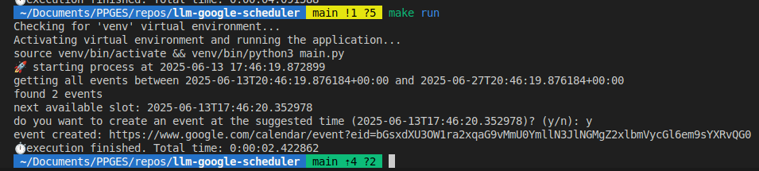
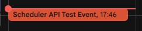

# **Google Scheduler API**

<p align="center"> 🚀 This script is designed to get Google Calendar events, find gaps in a given time range, and create a test event in that range if the user accepts  </p>

Execution Example



Event Created



<h3>🏁 Table of Contents</h3>

<br>

===================

<!--ts-->

💻 [Dependencies and Environment](#dependenciesandenvironment)

☕ [Using](#using)

👷 [Author](#author)

<!--te-->

===================

<div id="dependenciesandenvironment"></div>

## 💻 **Dependencies and Environment**

Dependencies and versions

- Python 3.10.12

<div id="using"></div>

## ☕ **Using**

First, check the [dependencies](#dependenciesandenvironment) process

you will need to enable the google calendar api and get the credentials.json file, [look the doc](https://developers.google.com/workspace/calendar/api/quickstart/python?hl=pt-br)

You can clean the environment using

```
$ make clean
```

to exec:

```
$ make run
```

<div id="author"></div>

#### **👷 Author**

Made by Glener Pizzolato! 🙋

[](https://www.linkedin.com/in/glener-pizzolato-6319821b0/)
[](mailto:glenerpizzolato@gmail.com)
