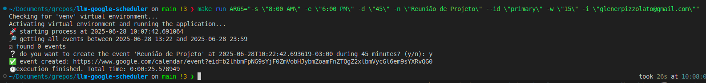
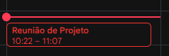

# **Find Available Slot in Google Calendar using Gemini**

<p align="center"> 🚀 This script is designed to get Google Calendar events, find gaps in a given time range using Gemini, and create a test event in that range if the user accepts  </p>

Execution Example



Event Created



<h3>🏁 Table of Contents</h3>

<br>

===================

<!--ts-->

💻 [Dependencies and Environment](#dependenciesandenvironment)

☕ [Using](#using)

👷 [Author](#author)

<!--te-->

===================

<div id="dependenciesandenvironment"></div>

## 💻 **Dependencies and Environment**

Dependencies and versions

- Python 3.10.12
- Python 3.12.3

**OBS**: This project is tested in Linux. For instructions on other operating systems, check the [Makefile](./Makefile) or exec directly.

<div id="using"></div>

## ☕ **Using**

First, check the [dependencies](#dependenciesandenvironment) process

you will need to enable the google calendar api and get the credentials.json file, [look the doc](https://developers.google.com/workspace/calendar/api/quickstart/python?hl=pt-br)

this project uses the paid Google Gemini API, it's necessary to configure a valid Gemini API Key. Ensure you have a `.env` file with the environment variable **API_KEY**.

You can clean the environment using

```
$ make clean
```

Exec unit tests with

```
$ make test
```

to exec:

```
$ make run
```

Below are the arguments that can be used when running the script, with a brief explanation of each:

- `-s`, `--start`: Sets the start time to search for availability (default: **9:00 AM**).
- `-e`, `--end`: Sets the end time to search for availability (default: **6:00 PM**).
- `-d`, `--duration`: Duration of each event in minutes (default: **60**).
- `-n`, `--name`: Name of the event to be created (default: **"Event created by Gemini"**).
- `--id`: Calendar ID where the event will be created (default: **"primary"**).
- `-w`, `--waiting`: Waiting time (in minutes) to look for available slots (default: **30**).
- `-i`, `--invites`: List of emails (comma-separated) to invite to the event (optional).

Example executing with all arguments:

```
$ make run ARGS="-s \"8:00 AM\" -e \"6:00 PM\" -d \"45\" -n \"Reunião de Projeto\" --id \"primary\" -w \"15\" -i \"glenerpizzolato@gmail.com\""
```

<div id="author"></div>

#### **👷 Author**

Made by Glener Pizzolato! 🙋

[](https://www.linkedin.com/in/glener-pizzolato-6319821b0/)
[](mailto:glenerpizzolato@gmail.com)
